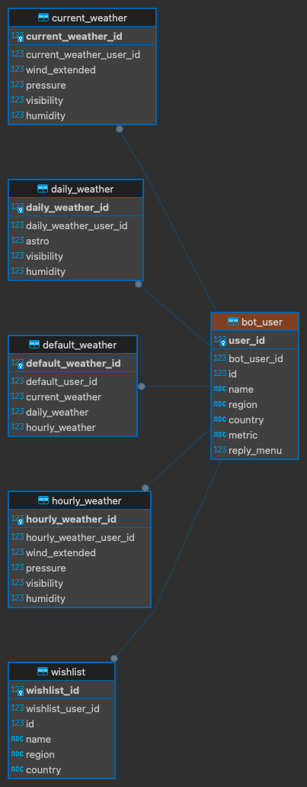
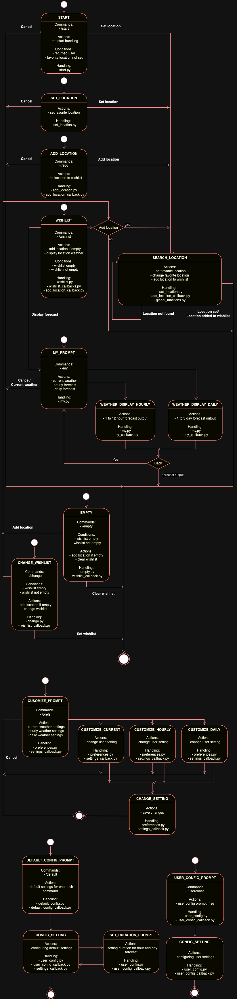

# Telegramm bot - WeatherBot

### Shortcut:

Weather forecast Telegramm bot with API and database.

## Functionality.

WeatherBot is a weather forecasting bot, which implements two main functionalities:

- store user's favorite city and output weather forecast by user's request;
- create and manage user's wishlist, which is a list of user's favorite places with weather forecast output followed by user's request.

Weather forecast is a data from openweathermap.org API.  
User's city and wishlist are stored in database SQLite3.

User's city forecast is shown by the user's command `/my`.  
User's wishlist is a reply-menu shown by user's command `/wishlist`. Forecast will be shown by pressing corresponding reply-button.  
If wishlist is empty or user city is not specified corresponding message will be shown.

## Main menu.

- /start - start weather forecasting
- /my - your city weather forecast
- /del - delete your city
- /change - change your city
- /wishlist - wishlist output
- /add - add place to a wish list
- /empty - clear your wishlist
- /remove - remove city from your wishlist
- /help - start helping me

## Command description and execution.

> #### 1. /start -  - start weather forecasting

***New user:***

- welcome message; 
- short description of bot functionality;
- help message;
- suggestion to add favorite city or start weather forecasting by typing a place name.

***Returned user:***

- welcome back message;
- reminder "your favorite location - ...".

***Current user:***

- help message.

> #### 2.  /my - user location weather forecast
Display user's favorite location forecast. Message with inline keyboard - current, hourly or daily forecast. 
Next step message with inline keyboard - number of hours (1-12) or days (1-3) forecast.

> #### 3. /onetouch - display weather upon user's default settings
Display current weather (if 'on'), hourly forecast - 1 to 12 hours, daily forecast - 1 to 3 days.

> #### 4. /default - default settings for 'onetouch' output
Setting current weather output (on/off), duration for hour and day forecast.

> #### 5. /set - set/reset user's favorite location
Setting new or reset current user's favorite location.

> #### 6. /wishlist - wishlist output
Show user's wishlist of favorite locations list as reply menu. Following forecast is shown after corresponding 
reply button press by user (see /my command execution).

> #### 7. /change - changing wishlist
Removing locations out of wishlist.

> #### 8. /add - add location to a wishlist
Adding new location to a user's wishlist by typing the name followed by confirmation - `Add`, `Cancel`.

> #### 9. /empty - clear wishlist
Clear user's wishlist.

> #### 10. /prefs - user preferences
Setting advanced weather output - additional weather information for wind^ humidity and so on.

> #### 11. /userconfig - user preferences
Setting units, bottom menu display.

> #### 12. /help - start helping me
Help message output.

## Database ER-diagram.

## State machine diagram.

